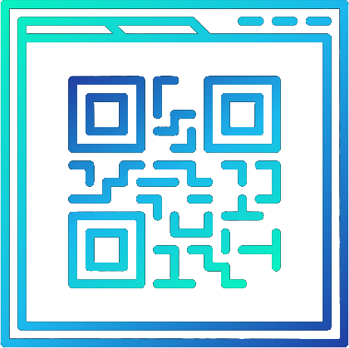

# ElastiQR

[](./frontend/public/../src/images/qr_logo.png.png)
## Contributors
- Eric Vaughan (VaughanEric)
- Logan O'Neal (LoganOneal)
- Jacob King (Jacobking61)
- Hayden Curl (hcurl)
- Caleb Fisher (cfisher36)

## Product Description

ElastiQR provides a dynamic QR solution so that users are able to alter the link that is stored in their QR codes. We give users a range of applications from elastic marketing campaigns to business cards. ElastiQR also aims to provide a collection of user insights such as origin tracking, scan activity, and link validation. For businesses wanting to heavily utilize our services, we provide functionality to automate interactions with our services so that their QR Codes can shape around everchanging business needs.

## Instructions about how to download, install, and run the product

### Standard Method: NPM

```shell
# Need to have Node.js installed. We're testing and stable at v16.13.0.

# Install dependencies and run backend
$ cd backend
$ npm i
$ npm start

# Install dependencies and run frontend
$ cd frontend
$ npm i
$ npm start

# Install dependencies and run the OAuth CLI
$ cd oauth-cli
$ npm i
$ node src/index.js --file FILE --expiresIn TIME[ex: 10h, 1d]
```

### Alternative Method: Docker

```shell
# Build docker images and start containers
$ docker compose up --build

# Install dependencies and run the OAuth CLI
$ cd oauth-cli
$ npm i
$ node src/index.js --file FILE --expiresIn TIME[ex: 10h, 1d]
```

## Instructions on how to use the product

### Getting Started

1. If you do not already have an account, go to the "SIGNUP" page to create one
2. Log in to your account on the "LOGIN" page

### Creating a QR Code

1. Go to the "CREATE QR" page
2. Provide the name and link for the QR code
3. (Optional) Add a description for the QR code
4. Click the "Create QR" button at the bottom

### Updating a QR Code

1. Go to the "MY QRS" page
2. Click on the QR code that you want to update
3. Scroll down to the bottom of the details page of your QR code
4. Update the link, description, or both
5. Click the "Update" button

### Downloading a QR Code

1. Go to the "MY QRS" page
2. Click on the QR code that you want to download
3. (Optional) Customize the appearance of your QR code using the "Download Options" dropdown
4. Click the "Download" button

### Viewing QR Code Stats

- For overall stats about all of your QR codes, go to the "HOME" or "PROFILE" pages
- For stats pertaining to individual QR codes, go to the "MY QRS" page and click on a specific QR code

### Logging Out

- There are two log out buttons
- One is located in the top right on the navigation bar
- The other is located on the "PROFILE" page

## License Information

[MIT License](https://github.com/ElastiQR/ElastiQR/blob/main/LICENSE.txt)
